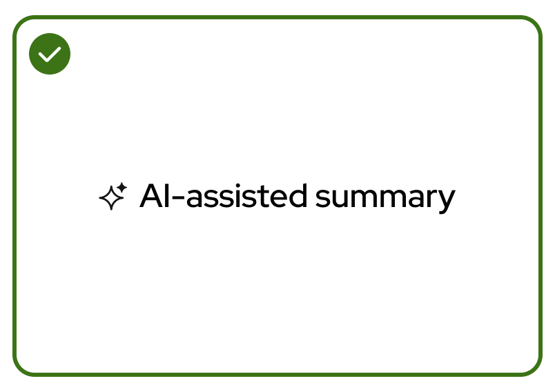
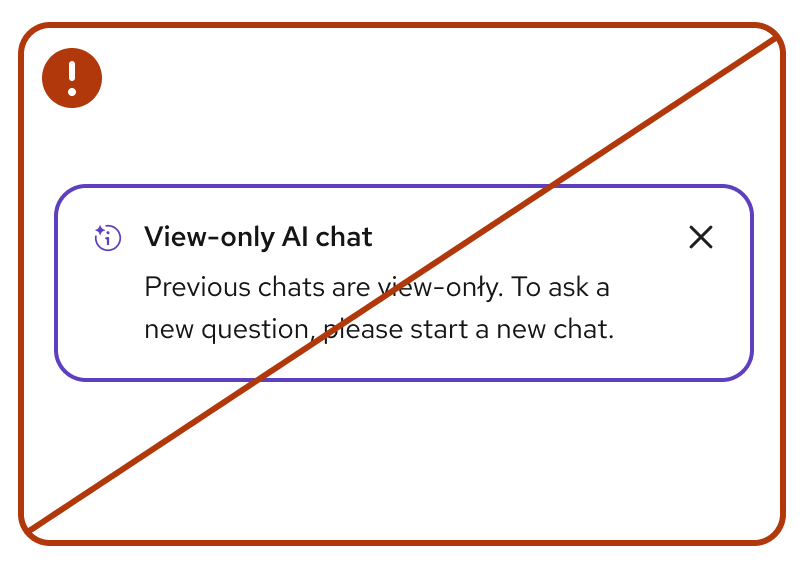
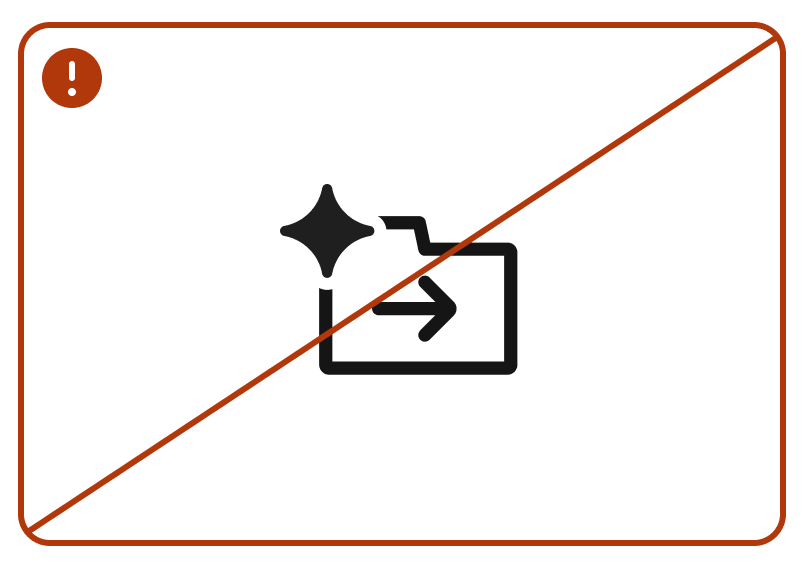
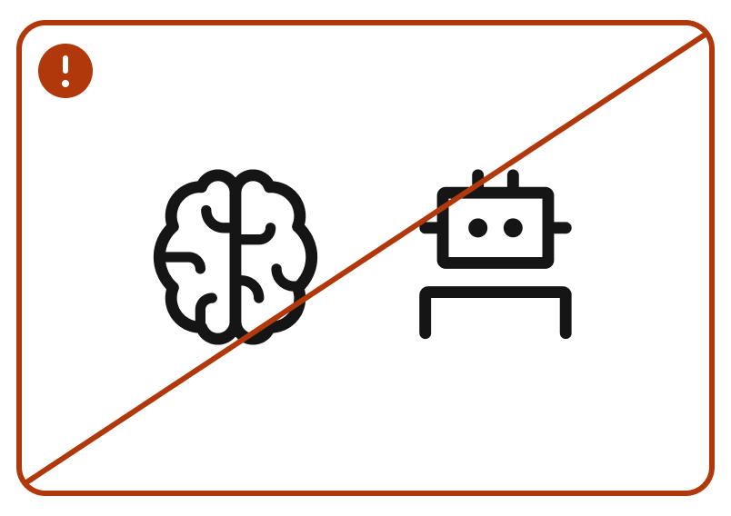
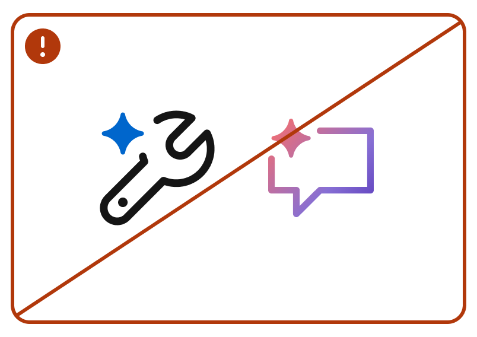
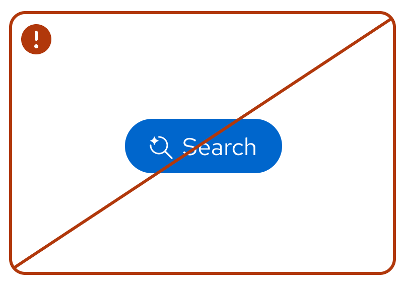
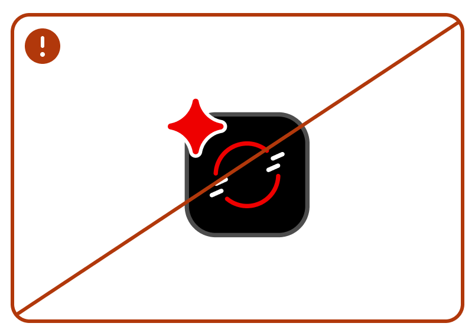
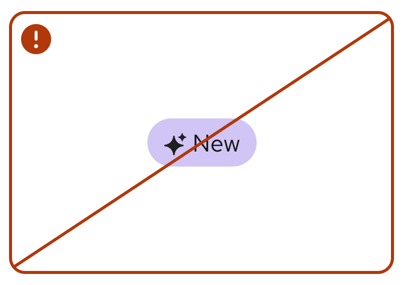

## Visual representations of AI

AI is widely used across Red Hat products and digital experiences, and there are a variety of ways to represent it in different parts of the Red Hat brand. Nearly every medium we use includes one or more ways to represent AI and related concepts.

- Use the appropriate visual for your use case and application.
- Consider the size of the space, the user's action, and their point in the customer journey.
- Representations include: UI icons, Standard icons, Technology icons, 3D objects, 3D textures, and Collages.

<ul data-type="examples">
  <li>
    <figure data-type="example">
      
      <figcaption>UI icons</figcaption>
    </figure>
  </li>
  <li>
    <figure data-type="example">
      
      <figcaption>Standard icons</figcaption>
    </figure>
  </li>
  <li>
    <figure data-type="example">
      
      <figcaption>Technology icons</figcaption>
    </figure>
  </li>
  <li>
    <figure data-type="example">
      
      <figcaption>3D objects</figcaption>
    </figure>
  </li>
  <li>
    <figure data-type="example">
      
      <figcaption>3D textures</figcaption>
    </figure>
  </li>
  <li>
    <figure data-type="example">
      
      <figcaption>Collages</figcaption>
    </figure>
  </li>
</ul>

## Use AI-related user interface icons

Red Hat has created a new set of UI icons to indicate when a feature or interaction will use AI.

- The icons are built on the recognition of existing UI icons and metaphors.
- Sparkles appear across Red Hat visuals to represent AI experiences.
- An initial set of 9 icons covers the majority of AI-related features and experiences.
- Example: Edit + AI = Edit with AI.

<figure data-type="example">
  
</figure>

## Guidelines for the AI sparkle

- When the sparkle is added to another icon, it sits in the same spot in the upper left corner of each icon for consistency (this position works best because many icons sit on a 45-degree angle).
- When necessary, the sparkle breaks into the outline of the icon with a minimum of 2px clear space around it for maximum legibility.
- Sparkles are square with slightly round ends, matching the proportions and details of other sparkles across the Red Hat design language.
- **Don't** create new AI icons.

<ul data-type="examples">
  <li>
    <figure data-type="example">
      
      <figcaption>Sparkles are square with slightly round ends, matching the proportions of other sparkles across the Red Hat design language.</figcaption>
    </figure>
  </li>
  <li>
    <figure data-type="example">
      
      <figcaption>The added sparkle sits in the same upper left corner of each icon for consistency.</figcaption>
    </figure>
  </li>
  <li>
    <figure data-type="example">
      
      <figcaption>When necessary, the sparkle breaks into the outline of the icon with a minimum of 2px clear space for legibility.</figcaption>
    </figure>
  </li>
</ul>

## Icons in use

Use an icon with an AI sparkle to indicate an AI-enabled action or AI-generated result. Icons with AI sparkles should always be paired with text (in the button or on hover) that says "...with AI", "...by AI", or something similar so that there are multiple indicators that AI is being used.

Research shows users need both text and an icon for clarity.

<figure data-type="do">
  
  <figcaption>Icons can be used in non-interactive components, like tags or labels, and on buttons.</figcaption>
</figure>

## Information icons

- **Where to use them**: On a pop-up, alert, card, or other informative element.
- **What they indicate**: These icons show users that the displayed content was generated with AI.
  -  `rh-ui-icon-ai-info`: When this icon is present, the information presented was partially or completely generated by AI.
  -  `rh-ui-icon-ai-error`: When this icon is present, a problem has been identified by/with help from AI.
  -  `rh-ui-icon-ai-experience`: Use this one when neither of the other icons fit.
- **Example**: A card showing an AI-generated summary of dashboard data.
- **Don't** create new AI icons.

[Download them in Brand Portal](https://url.corp.redhat.com/brand-portal-ui-icons)

## Action icons

- **Where to use them**: As a button or on a button.
- **What they indicate**: These icons indicate to the user that when they click on them, the next action will use or be enabled by AI.
  -  `rh-ui-icon-ai-edit`: When clicked, you can edit content with help from AI.
  -  `rh-ui-icon-ai-troubleshoot`: When clicked, you receive help or suggestions from AI to troubleshoot.
  -  `rh-ui-icon-ai-filter`: When clicked, you can filter data with help from AI.
  -  `rh-ui-icon-ai-search`: When clicked, you can search with help from AI.
  -  `rh-ui-icon-ai-create`: When clicked, you can create content with help from AI.
  -  `rh-ui-icon-ai-enhance`: When clicked, you can enhance content with help from AI.
  -  `rh-ui-icon-ai-experience`: Use this one when none of these other icons fit.
- **Example**: A button that will cause a pop-up to appear with AI-generated troubleshooting assistance.
- **Don't** create new AI icons.

[Download them in Brand Portal](https://url.corp.redhat.com/brand-portal-ui-icons)

## UI icon do's and don'ts

<ul data-type="dos-donts">
  <li>
    <figure data-type="do">
      
      <figcaption>Use UI icons with sparkles when indicating that the information it appears with was generated by AI.</figcaption>
    </figure>
  </li>
  <li>
    <figure data-type="dont">
      
      <figcaption>Don't use UI icons with sparkles when the information it is paired with was not generated by AI. Use the normal (no sparkle) UI icon instead.</figcaption>
    </figure>
  </li>
</ul>

## Icon don'ts

<ul data-type="dos-donts">
  <li>
    <figure data-type="dont">
      
      <figcaption>Don't create new UI icons with sparkles attached to them.</figcaption>
    </figure>
  </li>
  <li>
    <figure data-type="dont">
      
      <figcaption>Don't use brains or robots to represent AI features. The existing brain UI icon represents learning and education, and a robot icon should only be used for chatbot avatars.</figcaption>
    </figure>
  </li>
  <li>
    <figure data-type="dont">
      
      <figcaption>Don't edit the colors of UI icons. Use them in the same colors as other UI icons in the interface.</figcaption>
    </figure>
  </li>
  <li>
    <figure data-type="dont">
      
      <figcaption>Don't use UI icons with sparkles without including a disclosure about the use of AI.</figcaption>
    </figure>
  </li>
  <li>
    <figure data-type="dont">
      
      <figcaption>Don't add an AI sparkle to a technology icon.</figcaption>
    </figure>
  </li>
  <li>
    <figure data-type="dont">
      
      <figcaption>Don't use icons with the AI sparkle to indicate "new." Use <code>rh-ui-icon-new</code> instead.</figcaption>
    </figure>
  </li>
</ul>

> [!NOTE]
> To request a new icon, chat us on Slack at #help-brand.
