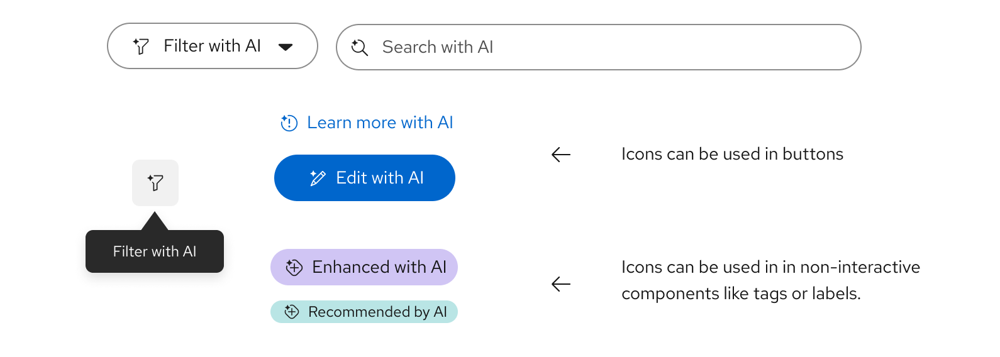

## Visual representations of AI

AI is widely used across Red Hat products, and there are a variety of ways to represent it in different parts of the Red Hat brand. Nearly every medium we use includes one or more ways to represent AI and related concepts.

- Use the appropriate visual for your use case and application.
- Consider the size of the space, the user's action, and their point in the customer journey.
- Representations include: UI icons, Standard icons, Technology icons, 3D objects, 3D textures, and Collages.

<figure data-type="example">

</figure>

## Use AI-related user interface icons

Red Hat has created a new set of UI icons to indicate when a feature or interaction will use AI.

- The icons are built on the recognition of existing UI icons and metaphors.
- Sparkles appear across Red Hat visuals to represent AI experiences.
- An initial set of 9 icons covers the majority of AI-related features and experiences.
- Example: Edit + AI = Edit with AI.

<figure data-type="example">

</figure>

## Guidelines for the AI sparkle

- When the sparkle is added to another icon, it sits in the same spot in the upper left corner of each icon for consistency (this position works best because many icons sit on a 45-degree angle).
- When necessary, the sparkle breaks into the outline of the icon with a minimum of 2px clear space around it for maximum legibility.
- Sparkles are square with slightly round ends, matching the proportions and details of other sparkles across the Red Hat design language.
- **Don't** create new AI icons.

<figure data-type="example">

</figure>

## Icons in use

Use an icon with an AI sparkle to indicate an AI-enabled action or AI-generated result. Icons with AI sparkles should always be paired with text (in the button or on hover) that says "...with AI", "...by AI", or something similar so that there are multiple indicators that AI is being used.

Research shows users need both text and an icon for clarity.

<figure data-type="do">

<figcaption>Icons can be used in non-interactive components, like tags or labels, and on buttons.</figcaption>
</figure>

## Information icons

- **Where to use them**: On a pop-up, alert, card, or other informative element.
- **What they indicate**: These icons show users that the displayed content was generated with AI.
  -  `rh-ui-icon-ai-info`: When this icon is present, the information presented was partially or completely generated by AI.
  -  `rh-ui-icon-ai-error`: When this icon is present, a problem has been identified by/with help from AI.
  -  `rh-ui-icon-ai-experience`: Use this one when neither of the other icons fit.
- **Example**: A card showing an AI-generated summary of dashboard data.
- **Don't** create new AI icons.
- [Download them in Brand Portal](https://url.corp.redhat.com/brand-portal-ui-icons)

## Action icons

- **Where to use them**: As a button or on a button.
- **What they indicate**: These icons indicate to the user that when they click on them, the next action will use or be enabled by AI.
  - [AI edit UI icon](../assets/images/rh-ui-icon-ai-edit.svg) `rh-ui-icon-ai-edit`: When clicked, users edit content with help from AI.
  - [AI troubleshoot UI icon](../assets/images/rh-ui-icon-ai-troubleshoot.svg) `rh-ui-icon-ai-troubleshoot`: When clicked, users receive help or suggestions from AI to troubleshoot.
  - [AI filter UI icon](../assets/images/rh-ui-icon-ai-filter.svg) `rh-ui-icon-ai-filter`: When clicked, users filter data with help from AI.
  - [AI search UI icon](../assets/images/rh-ui-icon-ai-search.svg) `rh-ui-icon-ai-search`: When clicked, users search with help from AI.
  - [AI create UI icon](../assets/images/rh-ui-icon-ai-create.svg) `rh-ui-icon-ai-create`: When clicked, users create content with help from AI.
  - [AI enhance UI icon](../assets/images/rh-ui-icon-ai-enhance.svg) `rh-ui-icon-ai-enhance`: When clicked, users enhance content with help from AI.
  - [AI experience UI icon](../assets/images/rh-ui-icon-ai-experience.svg) `rh-ui-icon-ai-experience`: Use this one when none of these other icons fit.
- **Example**: A button that will cause a pop-up to appear with AI-generated troubleshooting assistance.
- **Don't** create new AI icons.
- [Download them in Brand Portal](https://url.corp.redhat.com/brand-portal-ui-icons)

## UI icon do's and don'ts

- [AI-assisted summary with sparkle icon](../assets/images/do-use-sparkles-ai-gen-content.png "do") **Do**: Use UI icons with sparkles when indicating that the information it appears with was generated by AI.
- [Crossed out info alert with "View-only AI chat" message](../assets/images/do-not-use-sparkles-non-ai-gen-content.png "dont") **Don't**: Use UI icons with sparkles when the information it is paired with was not generated by AI. Use the normal (no sparkle) UI icon instead.

## Icon don'ts

- [Crossed out folder icon with a sparkle](../assets/images/do-not-create-new-icons-with-sparkle.svg "dont") **Don't** create new UI icons with sparkles attached to them.
- [Crossed out brain and robot icons](../assets/images/do-not-use-brains-or-robots.svg "dont") **Don't** use brains or robots to represent AI features. The existing brain UI icon represents learning and education, and a robot icon should only be used for chatbot avatars.
- [Crossed out AI troubleshooting and AI chat icons that have been re-colored](../assets/images/do-not-modify-or-change-colors-ui-icons.svg "dont") **Don't** edit the colors of UI icons. Use them in the same colors as other UI icons in the interface.
- [Crossed out AI search button without disclosure](../assets/images/do-not-use-icons-with-sparkle-without-ai-disclosure.svg "dont") **Don't** use UI icons with sparkles without including a disclosure about the use of AI.
- [Crossed out Red Hat OpenShift product/technology icon with sparkle](../assets/images/do-not-add-sparkle-to-tech-icon.svg "dont") **Don't** add an AI sparkle to a technology icon.
- [Crossed out "new" tag/label element with sparkle icon](../assets/images/do-not-use-ai-sparkle-icon-for-new.svg "dont") **Don't** use icons with the AI sparkle to indicate "new." Use `rh-ui-icon-new` instead.

> [!NOTE]
> To request a new icon, chat us on Slack at #help-brand.
